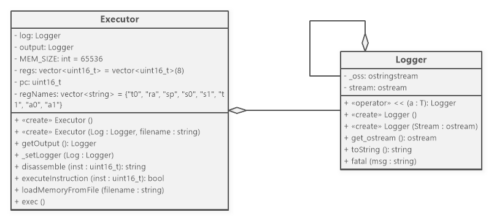

# V1.0

## Class Diagram

## [Change Log](CHANGELOG.md)

## Challenges Faced During Development
- Some issues regarding assembling files using the Z16 custom assembler regarding the existing bugs in the version of the assembler available during the development process.
- Correctly parsing offset/immediate values, especially 2's-complement-signed ones.
- Correctly implementing the B-type instructions which needed thorough debugging to debug several off-by-one bugs found during testing.

## Usage of AI
- Generative AI tools have been utilized to help catching some errors and generating/validating some test cases for the program.

## Test Coverage Matrix for the Z16 ISA

| #  | Instruction | Tests Covering It                          |
|----|-------------|--------------------------------------------|
| 01 | ADD         | 07                                         |
| 02 | SUB         | 07                                         |
| 03 | SLT         | 02                                         |
| 04 | SLTU        | 06                                         |
| 05 | SLL         | 06                                         |
| 06 | SRL         | 06                                         |
| 07 | SRA         | 06                                         |
| 08 | OR          | 10                                         |
| 09 | AND         | 10                                         |
| 10 | XOR         | 10                                         |
| 11 | MV          | 10                                         |
| 12 | JR          | 03                                         |
| 13 | JALR        | 03                                         |
|    |             |                                            |
| 14 | ADDI        | 03, 07, 09                                 |
| 15 | SLTI        | 02                                         |
| 16 | SLTUI       | 06                                         |
| 17 | SLLI        | 02                                         |
| 18 | SRLI        | 02                                         |
| 19 | SRAI        | 02                                         |
| 20 | ORI         | 10                                         |
| 21 | ANDI        | 10                                         |
| 22 | XORI        | 10                                         |
| 23 | LI          | 02, 03, 04, 05, 06, 07, 08, 09, 10, 11     |
|    |             |                                            |
| 24 | BEQ         | 04                                         |
| 25 | BNE         | 04                                         |
| 26 | BZ          | 04                                         |
| 27 | BNZ         | 04                                         |
| 28 | BLT         | 05                                         |
| 29 | BGE         | 05                                         |
| 30 | BLTU        | 05                                         |
| 31 | BGEU        | 05                                         |
|    |             |                                            |
| 32 | SB          | 08, 09, 11                                 |
| 33 | SW          | 09                                         |
|    |             |                                            |
| 34 | LB          | 08                                         |
| 35 | LW          | 09                                         |
| 36 | LBU         | 11                                         |
|    |             |                                            |
| 37 | J           | 03                                         |
| 38 | JAL         | 03                                         |
|    |             |                                            |
| 39 | LUI         | 01                                         |
| 40 | AUIPC       | 01                                         |
|    |             |                                            |
| 41 | ECALL 1     | 01, 02, 03, 04, 05, 06, 07, 09, 10, 11     |
| 42 | ECALL 5     | 08, 09                                     |
| 43 | ECALL 3     | 01, 02, 03, 04, 05, 06, 07, 08, 09, 10, 11 |
